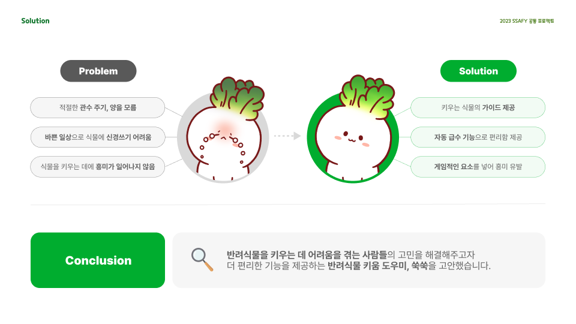
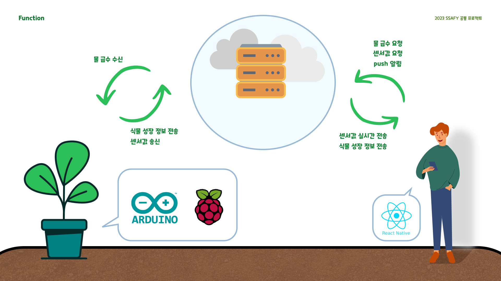
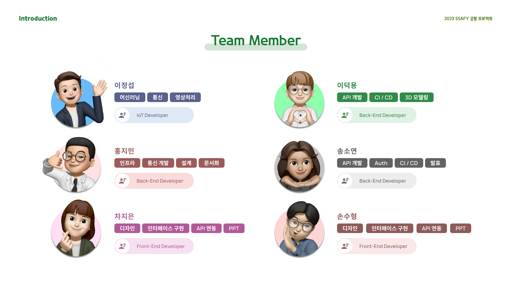

# README

# 🍃 Web IOT 프로젝트 - 쑥쑥

## 🌱 프로젝트 진행 기간 🌱

---

2023.07.10 ~ 2023.08.18

## 🌱 쑥쑥 - 배경 및 개요 🌱

---



## ✅ 기능 소개

---




### 화분

- **온습도 및 토양수분 감지** :  화분에 부착되어 있는 환경 관련 센서들을 활용하여 값을 측정합니다.
- **원격 급수 시스템** : 클라이언트에서 물 급수 요청을 보내면, 웹소켓 통신으로 화분 (라즈베리파이)과 연결 후 워터펌프를 동작시킵니다.
- **성장 척도 측정** : 화분의 카메라와 학습되어있는 티치블 머신을 활용하여 식물의 단계를 측정하고 서버에게 결과값을 보내줍니다.

### App (클라이언트)


## ✅ 기술 스택

---


## ✅ 프로젝트 파일 구조

---

### Back

```
  ssuk
    │  .gitignore
    │  build.gradle
    │  Dockerfile
    │  gradlew
    │  gradlew.bat
    │  settings.gradle
    │
    ├─gradle
    │  └─wrapper
    │          gradle-wrapper.jar
    │          gradle-wrapper.properties
    │
    └─src
        ├─main
        │  ├─generated
        │  │  └─com
        │  │      └─ssafy
        │  │          └─ssuk
        │  │              ├─measurement
        │  │              │  └─mapper
        │  │              │          MeasurementMapperImpl.java
        │  │              │
        │  │              ├─notify
        │  │              │  └─mapper
        │  │              │          FcmMapperImpl.java
        │  │              │
        │  │              └─pot
        │  │                  └─mapper
        │  │                          PotMapperImpl.java
        │  │
        │  ├─java
        │  │  └─com
        │  │      └─ssafy
        │  │          └─ssuk
        │  │              │  SsukApplication.java
        │  │              │
        │  │              ├─aop
        │  │              │      Aop.java
        │  │              │
        │  │              ├─badge
        │  │              │  ├─controller
        │  │              │  │      BadgeController.java
        │  │              │  │
        │  │              │  ├─domain
        │  │              │  │  │  Badge.java
        │  │              │  │  │  BadgeCode.java
        │  │              │  │  │  UserBadge.java
        │  │              │  │  │
        │  │              │  │  └─id
        │  │              │  │          UserBadgeId.java
        │  │              │  │
        │  │              │  ├─dto
        │  │              │  │  ├─request
        │  │              │  │  │      BadgeRegisterRequestDto.java
        │  │              │  │  │      BadgeUpdateRequestDto.java
        │  │              │  │  │
        │  │              │  │  └─response
        │  │              │  │          BadgeSearchResponseDto.java
        │  │              │  │          UserBadgeResponseDto.java
        │  │              │  │
        │  │              │  ├─repository
        │  │              │  │      BadgeRepository.java
        │  │              │  │      BadgeRepositoryImpl.java
        │  │              │  │
        │  │              │  └─service
        │  │              │          BadgeService.java
        │  │              │          BadgeServiceImpl.java
        │  │              │
        │  │              ├─collection
        │  │              │  ├─controller
        │  │              │  │      CollectionController.java
        │  │              │  │
        │  │              │  ├─domain
        │  │              │  │  │  Collection.java
        │  │              │  │  │
        │  │              │  │  └─id
        │  │              │  │          CollectionId.java
        │  │              │  │
        │  │              │  ├─dto
        │  │              │  │  └─response
        │  │              │  │          CollectionSearchResponseDto.java
        │  │              │  │
        │  │              │  ├─repository
        │  │              │  │      CollectionRepository.java
        │  │              │  │      CollectionRepositoryImpl.java
        │  │              │  │
        │  │              │  └─service
        │  │              │          CollectionService.java
        │  │              │          CollectionServiceImpl.java
        │  │              │
        │  │              ├─config
        │  │              │      AuthenticationConfig.java
        │  │              │      RedisConfig.java
        │  │              │      StompWebSocketConfig.java
        │  │              │
        │  │              ├─exception
        │  │              │  │  ExceptionHandlerFilter.java
        │  │              │  │
        │  │              │  ├─controller
        │  │              │  │      ExceptionController.java
        │  │              │  │
        │  │              │  └─dto
        │  │              │          CustomException.java
        │  │              │          CustomJwtException.java
        │  │              │          ErrorCode.java
        │  │              │          ErrorResponseEntity.java
        │  │              │
        │  │              ├─measurement
        │  │              │  ├─controller
        │  │              │  │      MeasurementController.java
        │  │              │  │      SensorSokcetController.java
        │  │              │  │
        │  │              │  ├─domain
        │  │              │  │      Measurement.java
        │  │              │  │      SensorType.java
        │  │              │  │
        │  │              │  ├─dto
        │  │              │  │  ├─request
        │  │              │  │  │      RaspberryRequestDto.java
        │  │              │  │  │      SensorGetDto.java
        │  │              │  │  │      UploadRequestDto.java
        │  │              │  │  │
        │  │              │  │  ├─response
        │  │              │  │  │      GroundResponseDto.java
        │  │              │  │  │      MeasurementResponseDto.java
        │  │              │  │  │      RecentMeasurementResponseDto.java
        │  │              │  │  │
        │  │              │  │  └─socket
        │  │              │  │          SensorEnterDto.java
        │  │              │  │          SensorMessageDto.java
        │  │              │  │
        │  │              │  ├─mapper
        │  │              │  │      MeasurementMapper.java
        │  │              │  │
        │  │              │  ├─repository
        │  │              │  │      MeasurementRepository.java
        │  │              │  │
        │  │              │  └─service
        │  │              │          MeasurementService.java
        │  │              │          MeasurementServiceImpl.java
        │  │              │
        │  │              ├─notify
        │  │              │  ├─controller
        │  │              │  │      NotificationController.java
        │  │              │  │      NotifyController.java
        │  │              │  │
        │  │              │  ├─domain
        │  │              │  │      Fcm.java
        │  │              │  │      Notification.java
        │  │              │  │      NotificationType.java
        │  │              │  │
        │  │              │  ├─dto
        │  │              │  │  │  FCMMessageDto.java
        │  │              │  │  │  PushRequestDto.java
        │  │              │  │  │  TokenRequestDto.java
        │  │              │  │  │
        │  │              │  │  └─response
        │  │              │  │          NotificationResponseDto.java
        │  │              │  │
        │  │              │  ├─mapper
        │  │              │  │      FcmMapper.java
        │  │              │  │
        │  │              │  ├─repository
        │  │              │  │      FcmRepository.java
        │  │              │  │      NotificationRepository.java
        │  │              │  │
        │  │              │  └─service
        │  │              │          FcmService.java
        │  │              │          NotificationService.java
        │  │              │          NotificationServiceImpl.java
        │  │              │
        │  │              ├─plant
        │  │              │  ├─controller
        │  │              │  │      GardenController.java
        │  │              │  │      PlantInfoController.java
        │  │              │  │
        │  │              │  ├─domain
        │  │              │  │  │  Category.java
        │  │              │  │  │  Garden.java
        │  │              │  │  │  Info.java
        │  │              │  │  │  Plant.java
        │  │              │  │  │
        │  │              │  │  └─id
        │  │              │  │          InfoId.java
        │  │              │  │
        │  │              │  ├─dto
        │  │              │  │  ├─request
        │  │              │  │  │      CategoryRegisterRequestDto.java
        │  │              │  │  │      CategoryUpdateRequestDto.java
        │  │              │  │  │      GardenDeleteRequestDto.java
        │  │              │  │  │      GardenOrdersRequestDto.java
        │  │              │  │  │      GardenRecordRequestDto.java
        │  │              │  │  │      GardenRegisterRequestDto.java
        │  │              │  │  │      GardenRenameRequestDto.java
        │  │              │  │  │      InfoRegisterRequestDto.java
        │  │              │  │  │      InfoUpdateRequestDto.java
        │  │              │  │  │      PlantRegisterRequestDto.java
        │  │              │  │  │      PlantUpdateRequestDto.java
        │  │              │  │  │      TotalCategoryRequestDto.java
        │  │              │  │  │
        │  │              │  │  └─response
        │  │              │  │          CategorySearchResponseDto.java
        │  │              │  │          GardenRegisterResponseDto.java
        │  │              │  │          GardenSearchOneResponseDto.java
        │  │              │  │          InfoSearchResponseDto.java
        │  │              │  │          NameId.java
        │  │              │  │          PlantSearchResponseDto.java
        │  │              │  │          ResponseDto.java
        │  │              │  │          TotalCategoryResponseDto.java
        │  │              │  │          TotalInfoResponseDto.java
        │  │              │  │          TotalPlantResponseDto.java
        │  │              │  │
        │  │              │  ├─repository
        │  │              │  │  ├─domain
        │  │              │  │  │      CategoryRepository.java
        │  │              │  │  │      CategoryRepositoryImpl.java
        │  │              │  │  │      GardenRepository.java
        │  │              │  │  │      GardenRepositoryImpl.java
        │  │              │  │  │      InfoRepository.java
        │  │              │  │  │      InfoRepositoryImpl.java
        │  │              │  │  │      PlantRepository.java
        │  │              │  │  │      PlantRepositoryImpl.java
        │  │              │  │  │
        │  │              │  │  └─query
        │  │              │  │          CategoryQueryRepository.java
        │  │              │  │          CategoryQueryRepositoryImpl.java
        │  │              │  │
        │  │              │  └─service
        │  │              │          CategoryService.java
        │  │              │          CategoryServiceImpl.java
        │  │              │          GardenService.java
        │  │              │          GardenServiceImpl.java
        │  │              │          InfoService.java
        │  │              │          InfoServiceImpl.java
        │  │              │          PlantService.java
        │  │              │          PlantServiceImpl.java
        │  │              │
        │  │              ├─pot
        │  │              │  ├─controller
        │  │              │  │      PotController.java
        │  │              │  │
        │  │              │  ├─domain
        │  │              │  │      Pot.java
        │  │              │  │
        │  │              │  ├─dto
        │  │              │  │  ├─requset
        │  │              │  │  │      PotDeleteDto.java
        │  │              │  │  │      PotInsertDto.java
        │  │              │  │  │
        │  │              │  │  └─response
        │  │              │  │          PotResponseDto.java
        │  │              │  │          PotSlideResponseDto.java
        │  │              │  │
        │  │              │  ├─mapper
        │  │              │  │      PotMapper.java
        │  │              │  │
        │  │              │  ├─repository
        │  │              │  │      PotRepository.java
        │  │              │  │
        │  │              │  └─service
        │  │              │          PotService.java
        │  │              │          PotServiceImpl.java
        │  │              │
        │  │              ├─user
        │  │              │  ├─controller
        │  │              │  │      AuthController.java
        │  │              │  │      KakaoController.java
        │  │              │  │      UserController.java
        │  │              │  │
        │  │              │  ├─domain
        │  │              │  │      Role.java
        │  │              │  │      User.java
        │  │              │  │
        │  │              │  ├─dto
        │  │              │  │  ├─request
        │  │              │  │  │      CheckEmailRequestDto.java
        │  │              │  │  │      CheckPasswordDto.java
        │  │              │  │  │      KakaoCodeRequsetDto.java
        │  │              │  │  │      LoginRequestDto.java
        │  │              │  │  │      RegisterUserRequestDto.java
        │  │              │  │  │      ResetPasswordDto.java
        │  │              │  │  │      UpdateNicknameDto.java
        │  │              │  │  │      UpdatePasswordDto.java
        │  │              │  │  │      VerifyEmailCodeDto.java
        │  │              │  │  │
        │  │              │  │  └─response
        │  │              │  │          InfoResponseDto.java
        │  │              │  │
        │  │              │  ├─repository
        │  │              │  │      RoleRepository.java
        │  │              │  │      UserRepository.java
        │  │              │  │
        │  │              │  └─service
        │  │              │          UserService.java
        │  │              │          UserServiceImpl.java
        │  │              │
        │  │              └─utils
        │  │                  ├─auth
        │  │                  │  ├─jwt
        │  │                  │  │      CustomUserDetailsService.java
        │  │                  │  │      JwtAuthenticationFilter.java
        │  │                  │  │      JwtTokenProvider.java
        │  │                  │  │      TokenInfo.java
        │  │                  │  │
        │  │                  │  └─oauth
        │  │                  │      └─kakao
        │  │                  │          │  KakaoAuthService.java
        │  │                  │          │
        │  │                  │          └─dto
        │  │                  │                  KakaoProfile.java
        │  │                  │                  KakaoProperties.java
        │  │                  │                  KakaoProviderProperties.java
        │  │                  │                  KakaoToken.java
        │  │                  │
        │  │                  ├─email
        │  │                  │      EmailMessage.java
        │  │                  │
        │  │                  ├─image
        │  │                  │      ImageInfo.java
        │  │                  │      ImageTestController.java
        │  │                  │      S3Config.java
        │  │                  │      S3UploadService.java
        │  │                  │
        │  │                  ├─jasypt
        │  │                  │      JasyptConfig.java
        │  │                  │
        │  │                  ├─p6spy
        │  │                  │      P6spyLogMessageFormatConfiguration.java
        │  │                  │      P6spySqlFormatConfiguration.java
        │  │                  │
        │  │                  ├─redis
        │  │                  │      RedisController.java
        │  │                  │      RedisService.java
        │  │                  │      RedisServiceImpl.java
        │  │                  │
        │  │                  ├─response
        │  │                  │      CommonResponseEntity.java
        │  │                  │      SuccessCode.java
        │  │                  │
        │  │                  └─weather
        │  │                          Weather.java
        │  │                          WeatherController.java
        │  │
        │  └─resources
        │      │  application.yml
        │      │  cloud.yml
        │      │  db.yml
        │      │  email.yml
        │      │  google-services.json
        │      │  jwt.yml
        │      │  key.json
        │      │  port.yml
        │      │
        │      └─templates
        │              home.html
        │              loading.html
        │
        └─test
            └─java
                └─com
                    └─ssafy
                        └─ssuk
                                SsukApplicationTests.java
```

### Front

```
└─src
    ├─components
    │  ├─alerttank
    │  │      index.jsx
    │  │      style.jsx
    │  │
    │  ├─alertwater
    │  │      index.jsx
    │  │      style.jsx
    │  │
    │  ├─badge
    │  │      index.jsx
    │  │      style.jsx
    │  │
    │  ├─common
    │  │      CookieRunBlack.jsx
    │  │      CookieRunBold.jsx
    │  │      CookieRunRegular.jsx
    │  │
    │  ├─currentimage
    │  │      index.jsx
    │  │
    │  ├─dropdown
    │  │      index.jsx
    │  │      style.jsx
    │  │
    │  ├─levelup
    │  │      index.jsx
    │  │      style.jsx
    │  │
    │  ├─modalchart
    │  │      index.jsx
    │  │      style.jsx
    │  │
    │  ├─modaldictionary
    │  │      index.jsx
    │  │      style.jsx
    │  │
    │  ├─modalexit
    │  │      index.jsx
    │  │      style.jsx
    │  │
    │  ├─modalInfo
    │  │      index.jsx
    │  │      style.jsx
    │  │
    │  ├─modalmap
    │  │      index.jsx
    │  │      style.jsx
    │  │
    │  ├─modalplantdelete
    │  │      index.jsx
    │  │      style.jsx
    │  │
    │  ├─modalplantregist
    │  │      index.jsx
    │  │      style.jsx
    │  │
    │  ├─modalplantseed
    │  │      index.jsx
    │  │      style.jsx
    │  │
    │  ├─modalsetting
    │  │      index.jsx
    │  │      style.jsx
    │  │
    │  ├─plantInfo
    │  │      index.jsx
    │  │      style.jsx
    │  │
    │  ├─plantpicking
    │  │      index.jsx
    │  │      style.jsx
    │  │
    │  ├─qrCode
    │  │      index.jsx
    │  │
    │  ├─SensorModal
    │  │      index.jsx
    │  │      style.jsx
    │  │
    │  └─toast
    │          index.jsx
    │
    ├─constants
    │      theme.jsx
    │
    ├─redux
    │      action.jsx
    │      reduxReducer.jsx
    │      store.jsx
    │
    ├─router
    │      router.jsx
    │
    ├─screens
    │  ├─alarm
    │  │      index.jsx
    │  │      style.jsx
    │  │
    │  ├─error
    │  │      index.jsx
    │  │
    │  ├─garden
    │  │      index.jsx
    │  │      style.jsx
    │  │
    │  ├─intro
    │  │      index.jsx
    │  │      style.jsx
    │  │
    │  ├─kakaologin
    │  │      index.jsx
    │  │      style.jsx
    │  │
    │  ├─loading
    │  │      index.jsx
    │  │      styles.jsx
    │  │
    │  ├─login
    │  │      index.jsx
    │  │      style.jsx
    │  │
    │  ├─main
    │  │      index.jsx
    │  │      style.jsx
    │  │
    │  ├─passwordfind
    │  │      index.jsx
    │  │      style.jsx
    │  │
    │  ├─passwordmake
    │  │      index.jsx
    │  │      style.jsx
    │  │
    │  ├─pot
    │  │      index.jsx
    │  │      style.jsx
    │  │
    │  ├─profile
    │  │      index.jsx
    │  │      style.jsx
    │  │
    │  ├─signup
    │  │      index.jsx
    │  │      style.jsx
    │  │
    │  ├─signupnickname
    │  │      index.jsx
    │  │      style.jsx
    │  │
    │  └─signuppassword
    │          index.jsx
    │          style.jsx
    │
    └─utils
            axios.jsx
```

### IoT

```jsx
│  client.py
│  keras_model.h5
│  labels.txt
│  README.md
│  requirements.txt
│  serial_number.txt
│
├─arduino
│      arduino.ino
│
├─img
│      flower_test.jpg
│      PLANT_11111111.jpg
│      seed_test.jpg
│      sprout_test.jpg
│      test.jpg
│
├─tensorflow
└─__pycache__
        client.cpython-37.pyc
```

## ✅ Figma

---


## ✅ ERD

---


## ✅ 팀원 역할 분배

---

